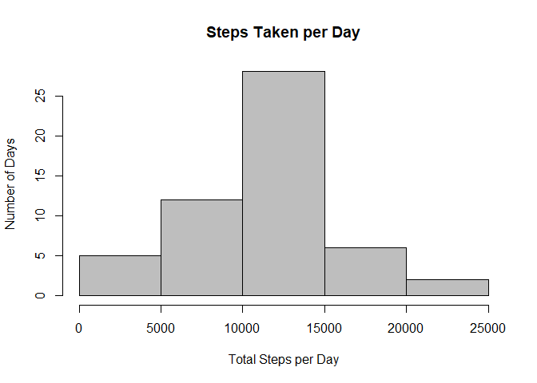
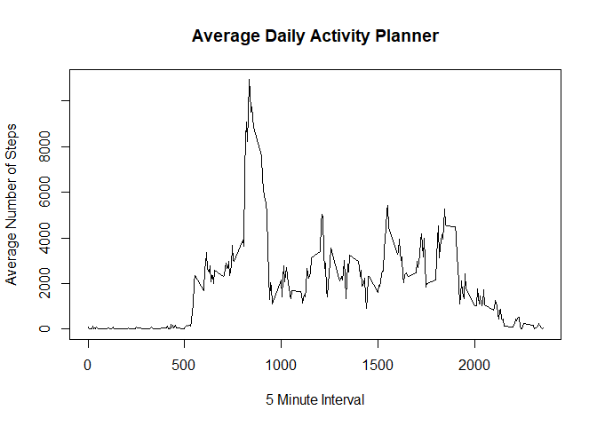
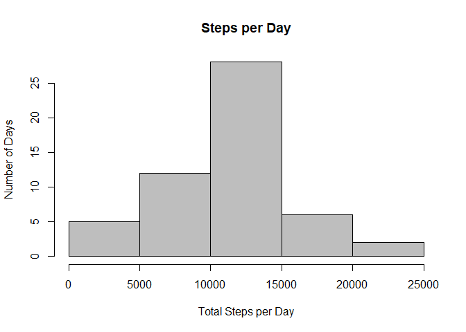
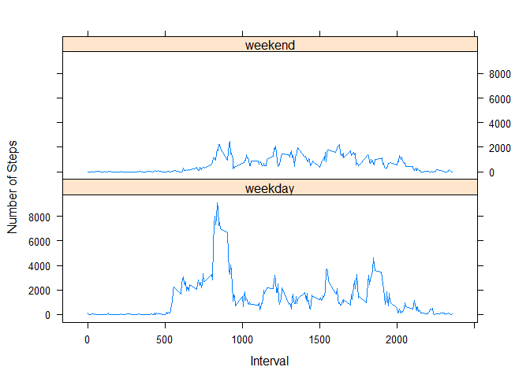

1.Loading and Preprocessing the data

    #Download data from Web
    download.file("https://d396qusza40orc.cloudfront.net/repdata%2Fdata%2Factivity.zip", destfile = "activity.zip", mode="wb")
    #Unzip Data and and store 
    unzip("activity.zip")
    dataset <- read.csv("activity.csv", header = TRUE)
    head(dataset)

    ##   steps       date interval
    ## 1    NA 2012-10-01        0
    ## 2    NA 2012-10-01        5
    ## 3    NA 2012-10-01       10
    ## 4    NA 2012-10-01       15
    ## 5    NA 2012-10-01       20
    ## 6    NA 2012-10-01       25

-&gt; Process/transform the data (if necessary) into a format suitable
for your analysis

    setDate <- transform(dataset, date = as.Date(date))
    str(setDate)

    ## 'data.frame':    17568 obs. of  3 variables:
    ##  $ steps   : int  NA NA NA NA NA NA NA NA NA NA ...
    ##  $ date    : Date, format: "2012-10-01" "2012-10-01" ...
    ##  $ interval: int  0 5 10 15 20 25 30 35 40 45 ...

1.  What is mean total number of steps taken per day?

-&gt;Ignoring missing values in the dataset.

    blank <- is.na(dataset$steps)
    setDate$isNA <- blank
    newdata <- setDate[setDate$isNA != 'TRUE',]
    nrow(newdata)

    ## [1] 15264

-&gt;Calculating the total number of steps taken per day and creating a
histogram.

    dataperday<-aggregate(steps~date,newdata,sum, na.rm = TRUE)
    hist(dataperday$steps, main="Steps Taken per Day", xlab="Total Steps per Day", ylab = "Number of Days", col = "gray")

-&gt;Calculating the Mean and Median Values

    mean <- mean(dataperday$steps)
    cat("Mean for total steps taken per day: ", mean, fill=TRUE)

    ## Mean for total steps taken per day:  10766.19

    median <- median(dataperday$steps)
    cat("Median for total steps taken per day: ", median, fill=TRUE)

    ## Median for total steps taken per day:  10765

1.  What is the average daily activity pattern?

-&gt; Making a time series plot (i.e. type = “l”) of the 5-minute
interval (x-axis) and the average number of steps taken, averaged across
all days (y-axis)

    avgsteps<-aggregate(steps~interval,newdata,sum, na.rm = TRUE)
    plot(x = avgsteps$interval,y = avgsteps$steps,type = "l",xlab = "5 Minute Interval", ylab = "Average Number of Steps",main = "Average Daily Activity Planner")

-&gt;Getting the average maximum steps per day in 5-minute interval

    max_avgsteps <- avgsteps$interval[avgsteps$steps == max(avgsteps$steps)]
    cat("5-min time Interval with maximum average steps taken per day: ", max_avgsteps, fill = TRUE)

    ## 5-min time Interval with maximum average steps taken per day:  835

1.  Imputing missing values

-&gt;Calculating the total number of missing values in the dataset

    blank_count <- sum(!complete.cases(dataset))
    cat("Missing value count for rows: ", blank_count, fill = TRUE)

    ## Missing value count for rows:  2304

-&gt;Filling in the missing date using mean data for missing values

    tofilldataset <- dataset
    sapply(unique(dataset$interval), function(x) tofilldataset[!complete.cases(tofilldataset) & (tofilldataset$interval == x),1] <- avgsteps$steps[avgsteps$interval == x])

    ##   [1]    91    18     7     8     4   111    28    46     0    78    16     7
    ##  [13]    17    36     8    18     0    59    97     9     9    20    14     0
    ##  [25]     0     0    60     0     0     7     0    12     0     0    82    50
    ##  [37]     0     0     0     0    11    33    86    31    26     4     0     0
    ##  [49]    63    50   136     0    18    19   218    35   185    44   165    59
    ##  [61]     0    83   159   119   176   157   111   321   849   972  2091  2358
    ##  [73]  1669  2611  2850  3363  2648  2495  2764  2085  2333  2341  1980  2599
    ##  [85]  2322  2352  2677  2889  2646  2702  2951  2349  2770  3686  3066  2976
    ##  [97]  3889  3615  6860  8349  9071  8236  9397 10927 10384  9517  9720  8852
    ## [109]  7603  6574  5783  5730  5497  5086  3509  2397  1314  2054  1854  1116
    ## [121]  2150  1430  2248  2791  2063  2692  2347  1983  1839  1502  1330  1693
    ## [133]  1662  1573  1130  1354  1504  1403  1772  2649  2228  2364  2440  3137
    ## [145]  3385  4648  5027  4917  3360  2659  2887  1718  1406  2000  2388  3566
    ## [157]  2244  2114  2293  2172  2451  2991  2266  1332  2118  2838  2508  3223
    ## [169]  2955  2754  2310  2581  1880  1990  2218  1458   907  1382  2312  2320
    ## [181]  1591  1912  1881  2059  2436  2531  2551  3462  4394  5229  5412  4450
    ## [193]  3293  3399  3951  3348  3016  3168  2325  2044  2367  2409  2449  2315
    ## [205]  2471  2984  2688  3245  3854  4184  3654  3162  3980  2995  1843  1985
    ## [217]  2156  3075  3959  4522  3141  3592  4118  3935  4523  5271  4589  4537
    ## [229]  4498  4125  3076  2828  1925  1098  1452  2121  1601  1354  2420  1777
    ## [241]  1040  1008  1025  1767  1421  1122  1447  1131  1036  1130  1712  1068
    ## [253]   845   913  1243  1020   660   425   777   864   460   413   431   139
    ## [265]    77   195   255   451   375   461   517   117    17     6    85   244
    ## [277]   175   151     0    44    51    84   138   249   175    34    12    57

-&gt;Calculating the total number of steps taken per day and creating a
histogram.

    secondsteps <- aggregate(steps~date,tofilldataset,sum)
    hist(secondsteps$steps,main = "Steps per Day", xlab = "Total Steps per Day", ylab = "Number of Days", col = "gray")

-&gt;Calculating the Mean and Median Values and Comparing to the
previous Mean and Median

    newmean <- mean(secondsteps$steps)
    cat("Old mean is: ", mean, fill = TRUE)

    ## Old mean is:  10766.19

    cat("Mean total steps taken per day: ", newmean, fill = TRUE)

    ## Mean total steps taken per day:  10766.19

    newmedian <- median(secondsteps$steps)
    cat("Old median is: ", median, fill = TRUE)

    ## Old median is:  10765

    cat("Median total steps taken per day: ", newmedian, fill = TRUE)

    ## Median total steps taken per day:  10765

1.  Are there differences in activity patterns between weekdays and
    weekends?

<!-- -->

    setDate$weekend <- "weekday"
    setDate$weekend[weekdays(setDate$date) %in% c("Saturday", "Sunday")] <- "weekend"
    setDate$weekend <- as.factor(setDate$weekend)
    thirdstep <- aggregate(steps~interval + weekend,data = setDate,sum, na.rm = TRUE)

-&gt;Making a panel plot containing a time series plot (i.e. type = “l”)
of the 5-minute interval (x-axis) and the average number of steps taken,
averaged across all weekday days or weekend days (y-axis).

    library(lattice)
    xyplot(steps~interval | weekend,thirdstep,type = "l", layout = c(1,2),xlab = "Interval", ylab = "Number of Steps")

